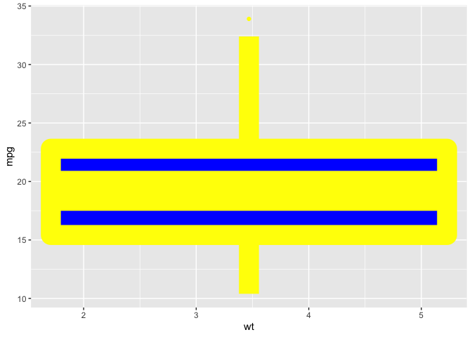
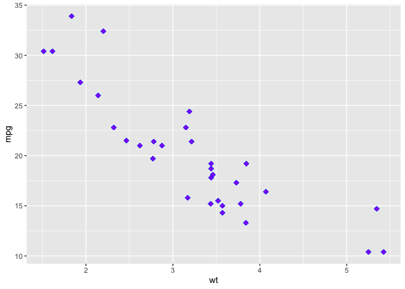

Homework 7 : Badplot
================
Brianna Green
10/7/2020

\#\#Badplot In this bad plot I used a box plot when a point plot
would’ve been more descriptive. I also increased the size of the line
connecting the dots in the plot which makes it difficult to see the
individual points on the plot and what value they represent.

``` r
df <- mtcars[, c("mpg", "cyl", "wt")]
df$cyl <- as.factor(df$cyl)
head(df)
```

    ##                    mpg cyl    wt
    ## Mazda RX4         21.0   6 2.620
    ## Mazda RX4 Wag     21.0   6 2.875
    ## Datsun 710        22.8   4 2.320
    ## Hornet 4 Drive    21.4   6 3.215
    ## Hornet Sportabout 18.7   8 3.440
    ## Valiant           18.1   6 3.460

``` r
library(ggplot2)
ggplot(df, aes(x=wt, y=mpg)) +
  geom_boxplot(shape=19, fill="blue", color="yellow", size=10)
```

    ## Warning: Continuous x aesthetic -- did you forget aes(group=...)?

<!-- -->

\#\#Better plot Here I changed the plot to be a scatter plot so it’s
easier to see which mgp points correspond to weight of the cars. I also
adjusted the size so that the values each point is associated with
clear.

``` r
df <- mtcars[, c("mpg", "cyl", "wt")]
df$cyl <- as.factor(df$cyl)
head(df)
```

    ##                    mpg cyl    wt
    ## Mazda RX4         21.0   6 2.620
    ## Mazda RX4 Wag     21.0   6 2.875
    ## Datsun 710        22.8   4 2.320
    ## Hornet 4 Drive    21.4   6 3.215
    ## Hornet Sportabout 18.7   8 3.440
    ## Valiant           18.1   6 3.460

``` r
library(ggplot2)
# change shape, color, fill, size
ggplot(df, aes(x=wt, y=mpg)) +
  geom_point(shape=23, fill="purple", color="blue", size=2)
```

<!-- -->
